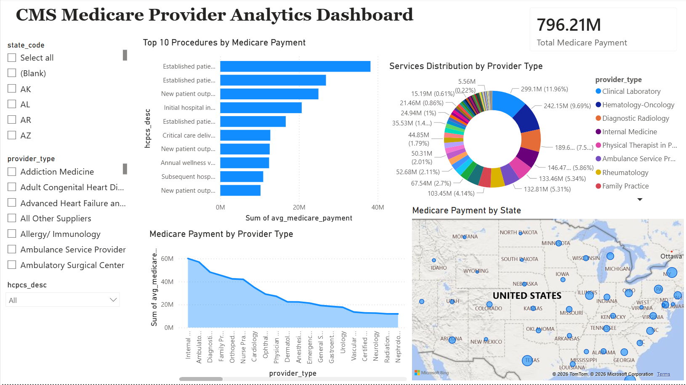

# CMS Medicare Provider Analytics Pipeline
An end-to-end data engineering project that ingests, transforms, and analyzes 9.8 million rows of CMS Medicare provider data.

## Architecture
CMS Data → Python ETL → PostgreSQL Star Schema → Power BI Dashboard

## Pipeline Phases
- Setup — Creates PostgreSQL schemas and warehouse tables
- Ingest — Downloads CMS data and bulk-loads into staging via PostgreSQL COPY
- Transform — Schema validation, null handling, and data quality checks
- Load — Populates star schema (dims + fact table)
- Queries — Runs analytical SQL queries

## Tech Stack
- Python — pandas, SQLAlchemy, psycopg2
- PostgreSQL — Star schema with fact and dimension tables
- Apache Airflow — Automated DAG with retry logic and execution logging
- Power BI — Interactive dashboard with state, provider, and procedure filters

## Dashboard


## Data
- Source: CMS Medicare Physician & Other Practitioners (by Provider and Service)
- Year: 2021
- Rows: ~9.8 million
- Tables: dim_provider (1.1M), dim_procedure (6.2K), dim_geography (54), fact_services (9.5M)

## Setup
1. Install dependencies: `pip install -r requirements.txt`
2. Configure `.env` with PostgreSQL credentials
3. Run pipeline phases in order:
```bash
python healthcare_pipeline.py setup
python healthcare_pipeline.py ingest
python healthcare_pipeline.py transform
python healthcare_pipeline.py load
python healthcare_pipeline.py queries
```
